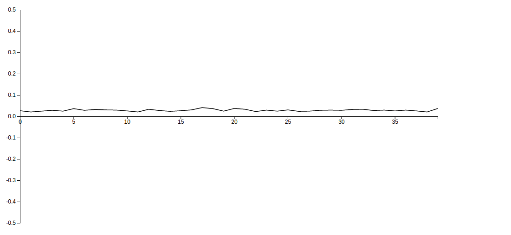

# Lab2 Report
利用ambient module去蒐集外界的聲音，將音量的變化在browser用D3這個module畫出來。同時對此振幅偵測設置閥值，若是音量超過閥值，便會使開發版上的led燈閃爍。

## Steps
- 進入 server directory

	```
	cd ./server
	```
- 開啟tessel2的access point

	```
	t2 ap -n <access_point_name>
	```
- 將電腦連上此access point
- 將server deploy

	```
	t2 run server.js
	```
- ambient module ready（可從terminal看到） 
- browser request [192.168.1.101:8001/display.html](192.168.1.101:8001/display.html)便可以從 browser觀看音量大小的變化。同時，若是音量超過閥值，便會使開發版上的led燈閃爍。

## Input

在tessel2上架一個web server，利用socket的方式來傳遞讀取的data給connect到的client並visualize。

以下為tessel讀取音量部份的程式碼：

- 我們將server開在tessel ap的ip address: 192.168.1.101，並利用socket.io 跟client傳資料。
	```
	server.listen(8001);
	console.log('running at 192.168.1.101:8001...');
	var serv_io = io.listen(server);
	```
- 在ambient的module確認ready之後，我們將trigger設定在0.01。ambient 音量大小的scale為 0~1，因此0.01看起來算是滿小的，原因在於我們希望能夠偵測到所有的data並將他顯示於browser上。
	```
	ambient.on("ready", function(){
		ambient.setSoundTrigger(0.01);
		console.log('ready');
		...
	}
	```

- 在設定好trigger後，這邊我們要求client要先connect到server，在開始進行ambient對音量data的採集。原因在於在connect之後採集的data才能夠被visualize。
	```
	serv_io.sockets.on('connection', function(socket){
		console.log('connected');
		...
	}
	```
- 最後一部份，當ambient的trigger被啟動後，會用socket.emit的方式將data傳送至client。
	```
	ambient.on("sound-trigger",function(sounddata){
				
		console.log(sounddata.toFixed(8));
		setInterval(function(){
			socket.emit('volume', {'volume': sounddata.toFixed(8)});
		}, 500);
	```



### Visualization

Visualization的部分是用D3來畫圖。先在 `display.html` 加入一個svg的element，並在這個svg上做圖。

- 在script中用d3.slect()選出這個svg，並在svg上append一個container element 'g'，設定margin跟抓出實際可畫圖的width跟height。

	```
	var svg = d3.select("svg"),
	            margin = {top: 20, right: 20, bottom: 20, left: 40},
	            width = +svg.attr("width") - margin.left - margin.right,
	            height = +svg.attr("height") - margin.top - margin.bottom,
	            g = svg.append("g").attr("transform", "translate(" + margin.left + "," + margin.top + ")");
	```

- x軸上取[0, 39]，y軸則是[-0.5, 0.5]，並用d3.linearScale()把這兩個範圍scale到剛剛的width和height上。

	```
	var x = d3.scaleLinear()
	        .domain([0, n - 1])
	        .range([0, width]);
	var y = d3.scaleLinear()
	        .domain([-0.5, 0.5])
	        .range([height, 0]);
	```

- 用 d3.line()create 一個 line generator，並設定x, y的 accessor。

	```
	var line = d3.line()
			.x(function(d, i) { return x(i); })
			.y(function(d, i) { return y(d); });
	```
- 加入`axis x`及`axis y`並設定位置到bottom及left。

	```
	g.append("g")
	    .attr("class", "axis axis--x")
	    .attr("transform", "translate(0," + y(0) + ")")
	    .call(d3.axisBottom(x));
	g.append("g")
	    .attr("class", "axis axis--y")
	    .call(d3.axisLeft(y));
	
	```
- 將socket送來的data，push進data這個array中。

	```
	socket.on('volume', function(newData) {
	            data.push(newData.volume);
	})
	```
- 重畫line，並用`shift()`將就的data移除。

	```
	function tick() {
	    // Redraw the line.
	    d3.select(this)
	        .attr("d", line)
	        .attr("transform", null);
	    // Slide it to the left.
	    d3.active(this)
	        .attr("transform", "translate(" + x(-1) + ",0)")
	        .transition()
	        .on("start", tick);
	    // Pop the old data point off the front.
	    data.shift();
	}
	```


## Output

- 我們將閥值設定在0.1，大約是一次拍手所發出的音量。當偵測到的data超越閥值時，tessel上的led燈會短暫的閃爍來告知。

	```
	ambient.on("sound-trigger",function(sounddata){
		...
					
		if(sounddata > 0.1){
			tessel.led[2].toggle();
			setTimeout(function(){
				tessel.led[2].toggle();
			},200);
		}
	});
	```
